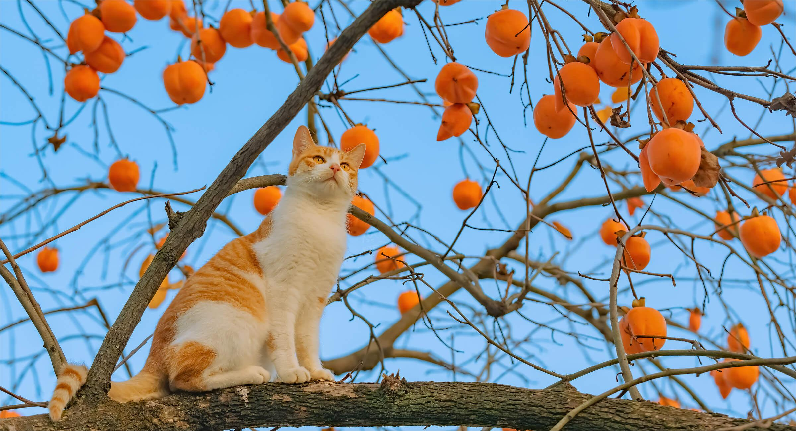

 
 <h2 align="center">把握好每一天，每天进步一点点</h2>
 
明日复明日，明日何其多，我生待明日，万事成蹉跎。

 

	
 

 <!-- https://img.shields.io/badge/taoxiaolin-changetheworld-brightgreen -->

<h1 align="center">Hello  I'm Taoxiaolin, nikename: Aco</h1>

- 🔋 前端开发爱好者
- 📡 在杭州工作 ing
- ✨ <a href="https://www.yuque.com/u205662" target="_blank">我的语雀博客</a>
- 💬 如有留言，可以在 github、语雀上留言（语雀有消息提醒，会快一点）
- 🌰 自控力，非常重要。
- 🤔 无知不是罪，拒绝学习才是罪恶。
- 🌱 别停下脚步啊，越努力越自由。

<!-- <h2>💼 项目</h2> -->

<h2>💼 数据统计</h2>

  
  

 

<!--
**changetheworldOuO/changetheworldOuO** is a ✨ _special_ ✨ repository because its `README.md` (this file) appears on your GitHub profile.

Here are some ideas to get you started:

- 🔭 I’m currently working on ...
- 🌱 I’m currently learning ...
- 👯 I’m looking to collaborate on ...
- 🤔 I’m looking for help with ...
- 💬 Ask me about ...
- 📫 How to reach me: ...
- 😄 Pronouns: ...
- ⚡ Fun fact: ...
-->
